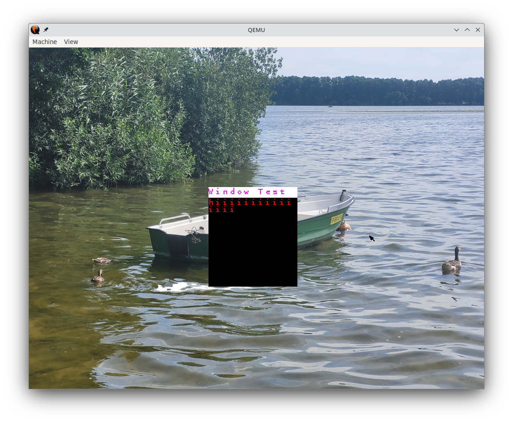

# GitOS

My personal graphical operating system project

## Goals

### Boot
- [x] Custom bootloader - GitBoot
  - [x] Loading kernel from ATA drive
  - [x] BIOS memory mapping routine
  - [x] Set VBE to 1024x768x32
  - [ ] Load kernel.elf from partition
- [x] GRUB Multiboot support

### Kernel
- [x] Global Descriptor Table
- [x] Interrupt Descriptor Table and handlers
#### Drivers
- [x] Disk driver with streaming support
- [x] Graphics driver with text mode and VBE support
- [x] PIC handling routines
- [x] PS2 keyboard support
- [x] PS2 mouse support
- [x] Serial port communication

#### Formats
- [x] Support for the ELF executable format

#### Filesystem
- [x] File operations and management routines
- [x] FAT16 filesystem support (w/o writing)
- [x] Memory-based filesystem
- [x] Pipe-based filesystem support
- [x] Path parsing functionality

#### Memory Management
- [x] Heap management
- [x] Paging support
- [x] Dynamic memory allocation

#### Task Management
- [x] Process management functionality
- [x] Task switching mechanisms
- [x] Recovering from task crashes
- [ ] Multitasking support
- [x] Process arguments and environment passing

#### Syscalls
- [x] Syscall interface
- [x] File operations support
- [x] Dynamic memory allocation
- [x] Executing processes

### Userland
- [x] Developed blank application
- [x] Graphical shell functionality
  - [x] Drawing background
  - [x] Graphical cursor
  - [ ] Compositor
- [x] C/C++ application support
- [x] Basic printing to kernel stdio
- [ ] Debugging userland applications

(Automated) documentation for this project can be found [Here](https://gitmanik.github.io/GitOS/files.html)

### Using:
* GCC/G++
* NASM
* qemu-system-i686
* CMake
* CLion with DevContainer
* Doxygen for documentation